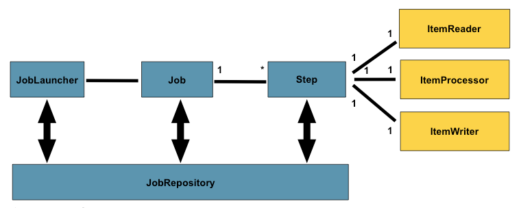
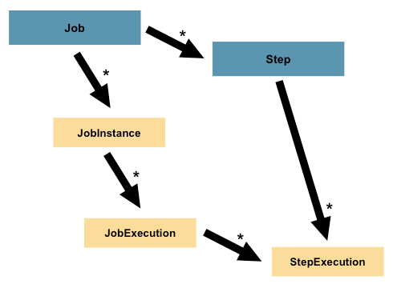
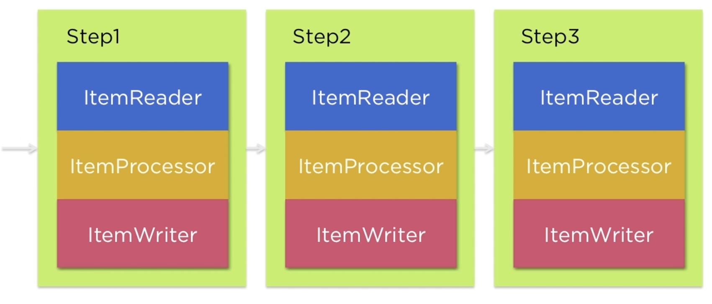

# Scheduling in Spring using Quartz Scheduler

### How does Spring Batch differ from Quartz? Is there a place for them both in a solution?
_Spring Batch and Quartz have different goals._

Spring Batch provides functionality for processing large volumes of data and Quartz provides functionality for scheduling tasks.

So Quartz could complement Spring Batch, but are not excluding technologies.

A common combination would be to use Quartz as a trigger for a Spring Batch job using a Cron expression and the Spring Core convenience SchedulerFactoryBean.

## Batch Terminology


A Job has one to many steps, each of which has exactly one `ItemReader`, one `ItemProcessor`, and one `ItemWriter`.
A job needs to be launched (with `JobLauncher`), and metadata about the currently running process needs to be stored (in `JobRepository`).

### Job
A Job is an entity that encapsulates an entire batch process.

Spring Batch at the fundamental is a State Machine.

A Job defines the list of states and how to transition from one state to the next.

## Step
A Step represents an independent piece of processing that makes up a job.
A Job may have many Steps.

A Step is a domain object that encapsulates an independent, sequential phase of a batch job.
Therefore, every Job is composed entirely of one or more steps.
A Step contains all the information necessary to define and control the actual batch processing.



## StepExecution
A `StepExecution` represents a single attempt to execute a `Step`.
A new `StepExecution` is created each time a `Step` is run, similar to `JobExecution`. However, if a step fails to execute because the step before it fails, no execution is persisted for it.
A `StepExecution` is created only when its `Step` is actually started.

Step executions are represented by objects of the `StepExecution` class.
Each execution contains a reference to its corresponding step and `JobExecution` and transaction related data, such as commit and rollback counts and start and end times.
Additionally, each step execution contains an `ExecutionContext`, which contains any data a developer needs to have persisted across batch runs, such as statistics or state information needed to restart.



Steps are executed sequentially.

`ItemProcessor` is optional.

## SQL statements

Create tables
```sql
CREATE TABLE source_products (
    id INTEGER NOT NULL PRIMARY KEY,
    name VARCHAR(50),
    created_at TIMESTAMP,
    modified_at TIMESTAMP
);

CREATE TABLE target_products (
    id INTEGER NOT NULL PRIMARY KEY,
    name VARCHAR(50),
    created_at TIMESTAMP,
    modified_at TIMESTAMP
);
```

Insert data into Source DB
```sql
insert into source_products values(1, 'rock', now(), now());

insert into source_products values(2, 'paper', now(), now());

insert into source_products values(3, 'scissor', now(), now());
```

Select statements
```sql
select * from target_products;

select * from batch_job_execution;

select * from batch_job_execution_context;

select * from batch_job_execution_params;

select * from batch_job_instance;

select * from batch_step_execution;

select * from batch_step_execution_context;
```

Clean Up
```sql
truncate source_products;

truncate target_products;

drop table source_products;
drop table target_products;
```